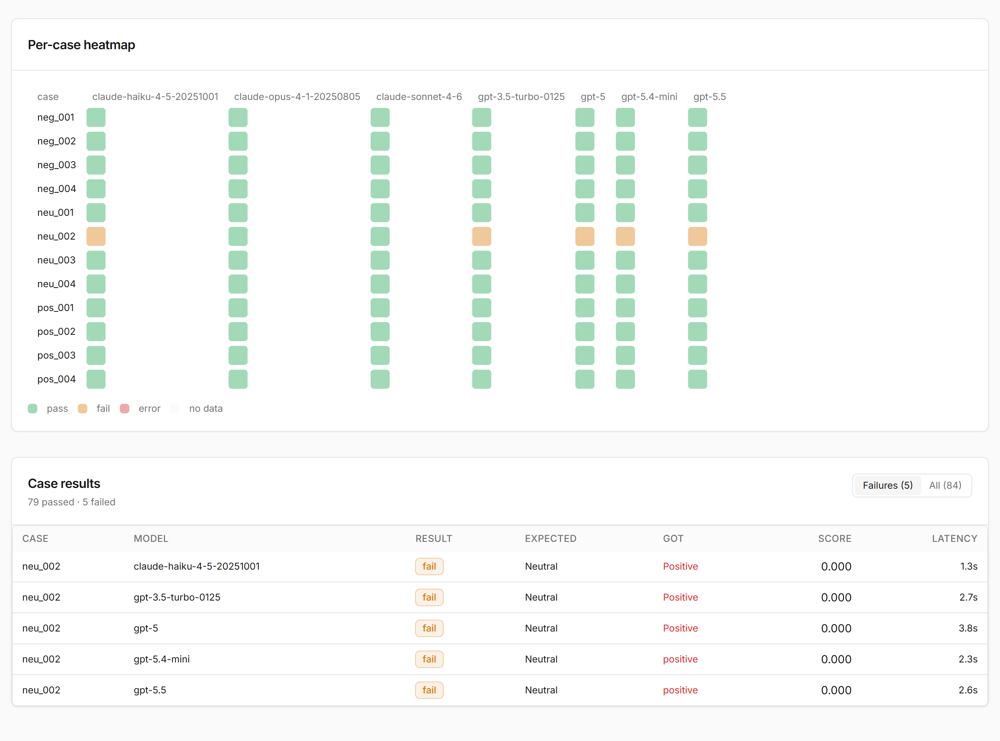

# clean-evals

> Measure AI quality across models. Build a golden dataset by working with real
> data. Pick the right model with the math in plain view.

[](https://pypi.org/project/clean-evals/)
[](https://pypi.org/project/clean-evals/)
[](LICENSE)
[](https://github.com/datathere/clean-evals/actions)

`clean-evals` is an open-source application for measuring AI quality
across models. It runs as its own process — a CLI plus a local web UI — and owns its
own data. You bring the prompts and inputs your application sends to a model;
clean-evals measures which model answers them best and what that costs.
Anthropic, OpenAI, Google, and OpenRouter models are supported out of the
box, and anything else through an adapter plugin.

> **clean-evals is a local tool.** It has no authentication and is designed to
> run on your own machine, bound to localhost. Do not deploy it to a public
> host or expose its ports to a network you do not fully trust. See
> [Disclaimers](#disclaimers).

Its capabilities, in order of importance:

1. **Dataset Builder.** Bring your inputs, run them through candidate models,
   pick or edit the best output, and lock it in as the expected answer. The
   golden dataset emerges from working with real data rather than from
   authoring JSON by hand.
2. **Eval Runner.** Async, queue-backed (Celery + Redis) or inline,
   deterministic where the provider allows it, and plugin-extensible, with
   strict typing and machine- and human-readable output.
3. **Decision UI.** A local web app showing leaderboards, per-case heatmaps,
   and three model recommendations side by side — maximum accuracy, best
   price/performance, and lowest cost — with the underlying math visible,
   plus cost projections.


## How it works

1. **Bring your inputs.** The upload wizard asks how your application talks
   to AI — complete requests, or one system prompt with varying data — and
   builds the dataset around your answer.
2. **Generate candidates.** Your cases run through the models you select
   (or a suggested slate of two cheap, two medium, two expensive), producing
   candidate outputs to compare.
3. **Review blind and lock golden answers.** You rate outputs 1 to 5
   without seeing which model wrote them, add feedback, and lock the best
   answer per case as the reference.
4. **Calibrate the judge.** For open-ended tasks, an LLM judge learns your
   standard from the ratings and feedback, and its agreement with you is
   measured before you rely on it.
5. **Run evals and decide.** Runs score the models against the golden
   dataset and end in a leaderboard with three recommendations — maximum
   accuracy, best price/performance, lowest cost — with the math in view.

Results drill down from the leaderboard to a per-case heatmap and to the
failing cases themselves, with the expected and actual answers side by side:



## Getting started

### Manual install (default)

Uses SQLite and local files. No database server or queue is required.

```bash
# 1. Install
pip install clean-evals

# 2. Add at least one provider API key to .env
cp .env.example .env

# 3. Initialize the database and start the app
clean-evals migrate
clean-evals serve          # http://localhost:8080
```

Three sample datasets are seeded on first start — ticket triage, sentiment,
and summarisation — so you can explore the workflow immediately, including
both exact-match scoring and the LLM judge.

Scheduled runs additionally require Redis plus the `clean-evals worker` and
`clean-evals beat` processes; `docker-compose up` starts that full stack
locally.

### Docker

```bash
git clone https://github.com/datathere/clean-evals
cd clean-evals
cp .env.example .env       # fill in API keys
docker-compose up
# UI: http://localhost:8080
```

All ports published by the compose file bind to `127.0.0.1`, so the stack is
reachable only from the machine running it.

### Run from source

```bash
git clone https://github.com/datathere/clean-evals
cd clean-evals
python -m venv .venv
source .venv/bin/activate            # Windows: .venv\Scripts\activate
pip install -e ".[dev]"

# Build the frontend into the package
cd web && npm install && npm run build && cd ..

cp .env.example .env                 # add API keys
clean-evals migrate
clean-evals serve
```

Start the app with `clean-evals serve`, not with uvicorn directly: `serve`
loads `.env`, seeds the sample dataset, and warns on non-local binds. Run it
from the directory that contains `.env`, and restart it after changing keys.

## Disclaimers

Read these before relying on clean-evals for anything that matters.

- **Not for deployment.** There is no authentication or authorization at any
  layer. Anyone who can reach the port can read your datasets, edit them, and
  trigger runs that spend your provider credits. Run it on localhost only.
  The shipped Docker configuration binds every port to `127.0.0.1` for this
  reason.
- **Cost limits are best-effort, not guarantees.** The per-run ceiling
  (`--max-cost`) is checked as results arrive; calls already in flight
  complete, so actual spend can overshoot the ceiling. The daily limit
  (`CLEAN_EVALS_DAILY_COST_LIMIT_USD`) counts only *persisted* runs — web and
  scheduled runs, and CLI runs with `--persist`. **Always verify actual spend
  in your model provider's billing console.**
- **Cost figures are estimates.** Costs are computed from a bundled pricing
  snapshot (plus any local overrides you configure). Providers change prices;
  the numbers in reports and recommendations are estimates, not invoices.
- **Your data is sent to model providers.** Every case input you run is sent
  to the third-party APIs of the models you select, subject to those
  providers' data-handling terms.
- **PII is not scrubbed automatically.** The optional `Scrubber` hook applies
  only to datasets loaded from YAML. Anything uploaded through the web UI is
  stored as-is. You are responsible for scrubbing your own data.
- **Data is stored in plain text on disk.** Prompts, model outputs, datasets,
  and rendered reports live unencrypted under `./clean-evals-data/` (and your
  configured database). Treat that directory as sensitive, and note there is
  no built-in retention or cleanup yet.
- **The SQLite default is single-user.** It is the right zero-configuration
  choice for one person on one machine. For a shared team instance, use the
  MySQL or Postgres backends — and put the whole thing on infrastructure you
  control, never the public internet.

## Why clean-evals

- **Decisions, not data.** Most eval tools produce JSON. clean-evals produces
  three recommendations side by side — maximum accuracy, best
  price/performance, lowest cost — with the comparison math in plain view.
- **Dataset construction is the first-class flow.** Building a golden dataset
  is most of the real work of evaluation, and the tool is designed around it.
- **No black boxes.** Readable source, plugin extension points, and dated
  model snapshots only — no `-latest` aliases that obscure what was actually
  measured.
- **Boring, typed Python.** `mypy --strict`, no `Any`, no magic. The source
  is meant to be read and trusted quickly.

## How ratings and feedback are used

- **Ratings and feedback are stored with the golden dataset.** In blind
  review you score a candidate output from 1 to 5 and can add written
  feedback. Both are saved on that output, under its case in the dataset —
  they are part of your evaluation data, not throwaway UI state.
- **Calibration turns your reviews into the judge's standard.** The judge
  prompt embeds up to six of your rated examples; outputs with written
  feedback are preferred, and the selection spans the rating range. The
  judge then scores new outputs against what you demonstrated rather than
  against a generic rubric.
- **Agreement is measured before you trust the judge.** During calibration
  the judge re-scores your rated outputs, drawing its examples from other
  cases than the one being judged (leave-one-case-out), so the number is
  not circular. Agreement is reported as the share of outputs scored
  identically, the share within one point, and Cohen's kappa — 0.6 is the
  commonly used bar.
- **The calibrated rubric becomes the dataset's scorer configuration.**
  Once calibration completes, eval runs are scored by the standard you
  signed off on, not by a hand-written prompt.
- **The judge never sees model names.** Review is blind, and the judge is
  shown inputs, outputs, ratings, and feedback only. It learns your quality
  bar rather than a brand preference, so it can fairly score models nobody
  rated during review.

## Plugin extension points

| Extension point | Entry-point group        | Use case                        |
| --------------- | ------------------------ | ------------------------------- |
| Scorer          | `clean_evals.scorers`    | Custom accuracy metrics         |
| Adapter         | `clean_evals.adapters`   | Private/internal model gateways |
| Reporter        | `clean_evals.reporters`  | Custom output destinations      |

Register via `pyproject.toml`:

```toml
[project.entry-points."clean_evals.scorers"]
my_scorer = "my_package.scorers:MyScorer"
```

## Working with production data

PII handling is your responsibility (see [Disclaimers](#disclaimers)). For
datasets loaded from YAML, a `Scrubber` plugin you write can clean cases
before they are stored:

```python
from clean_evals import Dataset, Scrubber

class MyScrubber(Scrubber):
    def scrub(self, case): ...

ds = Dataset.from_yaml("path.yml", scrubber=MyScrubber())
```

## Documentation

Full documentation at <https://datathere.github.io/clean-evals> (or
browse the sources below; build locally with `mkdocs serve`):

- [Getting Started](docs/docs/getting-started.md)
- [The Golden Path (product flow)](docs/docs/flow.md)
- [Public API Reference](docs/docs/api.md)
- [CLI Reference](docs/docs/cli.md)
- [Writing a Scorer](docs/docs/guides/writing-a-scorer.md)
- [Writing an Adapter](docs/docs/guides/writing-an-adapter.md)
- [Writing a Reporter](docs/docs/guides/writing-a-reporter.md)
- [Dataset Builder](docs/docs/guides/dataset-builder.md)
- [Running clean-evals](docs/docs/guides/deployment.md)
- [Brand Policy](BRANDING.md)

## License

Copyright (c) 2026 datathere.

clean-evals is open source under the [GNU AGPL-3.0](LICENSE). You may use,
modify, and redistribute it under the license terms, including commercially.
The AGPL's copyleft applies: if you modify clean-evals and make it available
to others, including over a network, you must make your modified source code
available under the same license.

**Commercial licenses** are available for organizations that cannot accept
the AGPL's obligations. Contact `licenses@datathere.com`.

The "clean-evals" and "by datathere" marks are governed by the
[Brand Use Policy](BRANDING.md); the in-product attribution is a protected
legal notice under section 7(b) of the license and must remain intact.

---

clean-evals · by datathere · <https://github.com/datathere/clean-evals>
