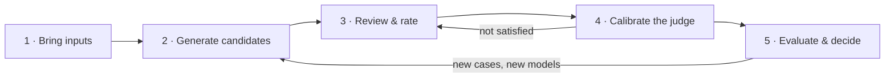

# The golden path

This document describes the product's core workflow: how a user goes from
"I have an AI feature and no idea which model to use" to "I picked a model,
with evidence." The five stages map to the product's screens.



The loop in the middle is the central idea: **your ratings build the golden
dataset and teach the judge at the same time.** The loop ends when the
judge agrees with your ratings often enough to be trusted on its own.

---

## Stage 1 — Bring inputs

A model request is never just "a prompt". Real applications compose up to
three layers, and they change at different speeds:

| Layer | What it is | Example | Changes |
| ----- | ---------- | ------- | ------- |
| **System prompt** | Instructions: how the model should behave | "You are a support agent for Acme. Classify the ticket as billing, fraud, or technical. Reply with the category only." | Per app / feature |
| **Context** | Reference material the model reads | Policy doc, product catalog, schema, the retrieved chunks in a RAG app | Per app *or* per case |
| **Variables** | The dynamic data being processed | The ticket, the user message, the record | **Per call** |

The eval only makes sense if clean-evals knows which layer is which — so
the very first question the setup asks is:

### "How does your app talk to the model?"

The answer decides the path:

**Path A: "I send complete, already-assembled requests."**
Your code merges instructions, context, and data into a single payload and
sends it. To evaluate that faithfully, export those finished requests and
upload them, one per row. clean-evals sends the rows unchanged. Use this
path to evaluate what production sends today, such as replayed request
logs.

**Path B: "Same setup, different data."**
The system prompt (and usually the context) is reused across calls; only
the ticket or message varies. Enter the shared layers once and upload
only the variables:

1. **System prompt.** Paste the instructions your app sends.
2. **Context** (optional). Choose how it applies:
    - **Shared.** Paste or upload it once.
    - **Per-case.** Your upload has a `context` column. This fits RAG
      applications, where cases carry their own retrieved material.
    - **Both.** The shared base and the per-case column are concatenated.
3. **Test cases.** Upload the rows of variables.
4. **Preview.** Before anything is saved, the screen shows the assembled
   request for the first case with the three layers visually
   distinguished, next to the parsed case table. Models receive the request
   as shown.

Requests are assembled the way providers expect them: the system prompt is
sent in the **system role**; context and variables are rendered into the
**user message** through a visible, editable template that defaults to:

```
{context}

{case}
```

`{case}` renders the case's variables — raw text when there is a single
field, JSON when there are several. Named placeholders (`{ticket}`,
`{customer_tier}`) are available when field-level placement matters.

### Why the layers stay separate (Path B)

- **Golden answers survive prompt changes.** The expected output pairs
  with the *variables*, not the assembled string — so you can rewrite the
  system prompt later and re-evaluate against the same locked dataset.
  In Path A, changing your prompt requires a new dataset.
- **Prompt iteration becomes an eval, later.** Once the system prompt is a
  first-class field, "prompt v2 vs prompt v3, same model, same cases" is
  the same machinery as "model A vs model B".
- **Cost estimates get accurate.** A 30-page shared context dominates token
  cost; knowing it's a shared prefix also lets cost projection account for
  provider prompt caching.
- **Review stays readable.** Stage 3 shows the reviewer the ticket itself,
  not the repeated instructions.

### Upload format (both paths)

One row = one **test case** (a "case" in the UI). Two reserved keys;
remaining columns are variables:

| Key | Meaning |
| --- | ------- |
| `id` | Optional stable name for the case (auto-generated if absent) |
| `context` | Optional per-case context (Path B, per-case or both) |

=== "CSV"

    ```csv
    id,ticket
    ticket_001,"My card was charged twice for the same order"
    ticket_002,"How do I change the email on my account?"
    ```

=== "JSONL"

    ```json
    {"id": "ticket_001", "ticket": "My card was charged twice for the same order"}
    {"id": "ticket_002", "ticket": "How do I change the email on my account?"}
    ```

=== "JSON"

    ```json
    [
      {"id": "ticket_001", "ticket": "My card was charged twice for the same order"},
      {"id": "ticket_002", "ticket": "How do I change the email on my account?"}
    ]
    ```

=== "YAML"

    ```yaml
    - id: ticket_001
      ticket: "My card was charged twice for the same order"
    - id: ticket_002
      ticket: "How do I change the email on my account?"
    ```

**How many cases?** Start with 10 to 50. Fewer than 10 gives noisy scores;
more than 50 makes stage 3 review slow. Grow the dataset after the flow
works end to end.

**Where real teams get these:** production logs, support exports, QA
spreadsheets. If the data contains PII, scrub it first — see
[Production data and PII](guides/pii.md).

**UI contract for this stage:** a two-question wizard (request shape, then
context shape) instead of a bare file input; inline examples and a
downloadable template per path; and the assembled-request preview before
anything is saved.

---

## Stage 2 — Generate candidates

You picked models you're considering (say `claude-haiku-4-5-20251001`,
`gpt-4o-mini-2024-07-18`, `gemini-2.0-flash-001`). clean-evals runs the dataset
through the candidate models once and stores the outputs.

Nothing is scored yet — there is nothing to score against. These outputs
exist so you can *choose* the golden answer from real material instead of
authoring JSON by hand.

- Cost guard: the run shows a cost estimate before it starts and respects
  `max_cost_usd`.
- Outputs are stored per `(case, model)` and survive refreshes; generation
  can be re-run for new models without touching existing ratings.

---

## Stage 3 — Review & rate

The core screen. One case at a time:

```
┌─────────────────────────────────────────────────────────────┐
│ ticket_001 · "My card was charged twice for the same order" │
├─────────────────────────────────────────────────────────────┤
│ Output A                        Output B                    │
│ "Billing → Duplicate charge"    "Category: billing_dispute" │
│ ☆☆☆☆☆  [feedback…]              ☆☆☆☆☆  [feedback…]          │
│                                                             │
│ Output C                                                    │
│ "billing"                                                   │
│ ☆☆☆☆☆  [feedback…]                                          │
│                                                             │
│ [✓ Pick best]   [✎ Edit and use]   [Skip case]              │
└─────────────────────────────────────────────────────────────┘
```

This is **human review** (what other tools call annotation). Per case you
do three things:

1. **Rate the outputs 1–5.** Outputs are shown **blind** — model names
   hidden until after you rate, so brand reputation can't leak into the
   scores.
2. **Write feedback where a rating needs explaining.** "Too verbose",
   "wrong category, this is fraud not billing", "perfect format". This
   text becomes judge calibration material in stage 4.
3. **Pick the best output** (or edit one, or write your own) and lock it.
   The locked answer is the **expected output** — the ground truth — for
   that case.

Progress is visible the whole time: `17/40 locked`. Once fully locked, the
dataset is **golden** — versioned and immutable from then on;
edits bump the version so old runs stay comparable.

---

## Stage 4 — Calibrate the judge

Deterministic tasks (classification, extraction) can stop here — `exact_match`
or `json_field_match` against the golden answer is cheap and objective.

Open-ended tasks (summaries, drafts, rewrites) need **LLM-as-a-judge** —
and an uncalibrated judge is just a different model's opinion. Calibration
(the industry also says *aligning* the judge) turns your Stage 3 review
into the judge's standard:

1. The expected output, your ratings, and your written feedback become
   few-shot examples in the judge prompt: *this output got 2/5 because
   "too verbose"; this got 5/5.*
2. The judge then re-scores the same candidate outputs you already rated.
3. The UI shows **agreement**: judge score vs your rating, case by case,
   plus one overall number (% within ±1 point, and Cohen's kappa — the
   standard chance-corrected agreement statistic; ≥ 0.6 is the commonly
   used bar).
4. Disagree with the judge somewhere? Add feedback on that case and
   re-calibrate. **Loop until the agreement number satisfies you.**

The judge config (model, prompt, few-shot examples, version) is stored with
the dataset, so future runs are scored by the standard you signed
off on.

---

## Stage 5 — Evaluate & decide

Now — and only now — the classic eval run (LangSmith and Braintrust call
this an *experiment*): the selected models run against the golden dataset, scored by
the calibrated judge (or exact match), producing what the Decision UI
already shows:

- **Leaderboard** — score, pass rate, p95 latency, $/run, $/correct.
- **Three recommendations** — max accuracy, best price/performance, lowest
  cost, with the math written out.
- **Case results** — what passed, what failed, expected vs got, one click
  to the full input/golden/answer view.
- **Cost projection** — monthly cost at your real traffic volume.

New model comes out next quarter? Add it, rerun Stage 5 against the same
locked dataset and judge. The comparison stays valid because the standard
did not change.

---

## Where the implementation stands

All five stages are built and connected in the web UI:

| Stage | Where it lives |
| ----- | -------------- |
| 1 · Bring inputs | Upload wizard with both request shapes, prompt spec stored on the dataset, assembled-request preview |
| 2 · Generate candidates | "Generate candidates" in the Dataset Builder, or `clean-evals generate` on the CLI |
| 3 · Review & rate | Blind side-by-side outputs with 1–5 ratings, written feedback, and pick-best-locks-golden |
| 4 · Calibrate the judge | "Calibrate" in the Dataset Builder, or `clean-evals calibrate`; agreement (exact, within ±1, kappa) is stored with a versioned judge config |
| 5 · Evaluate & decide | Run launcher on the Dataset Builder and Runs pages, ending in the leaderboard and recommendations |

The dataset carries a **prompt spec** (request shape, system prompt,
shared context, user-message template), and stages 2–4 persist to the
`candidate_outputs`, `ratings`, and `judge_configs` tables.

---

## Terminology

clean-evals uses the shortest widely understood terms. If
you're coming from another tool, this is the mapping:

| clean-evals | Also known as | Used by |
| ----------- | ------------- | ------- |
| case | test case, example, record | promptfoo (`tests`), LangSmith ("examples"), Braintrust ("records") |
| variables | vars, input variables, inputs | promptfoo (`vars`), LangSmith, Braintrust (`input`) |
| system prompt | instructions, developer message | Anthropic/OpenAI APIs |
| expected output | reference output, ground truth, ideal, label | LangSmith, Braintrust (`expected`), OpenAI Evals (`ideal`) |
| golden dataset | golden set, ground-truth dataset | industry-wide |
| scorer | evaluator, grader, assertion | LangSmith ("evaluators"), OpenAI Evals ("graders"), promptfoo (`assert`) |
| LLM judge | LLM-as-a-judge, autorater | industry-wide |
| calibrate | align (the judge), judge alignment | LangSmith ("Align Evals") |
| review & rate | human review, annotation, labeling | LangSmith ("annotation queues") |
| run | experiment | LangSmith, Braintrust |
