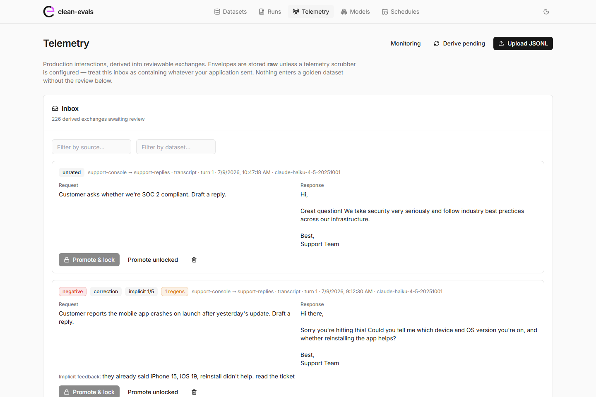
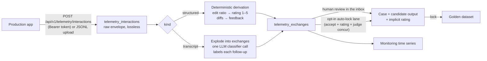
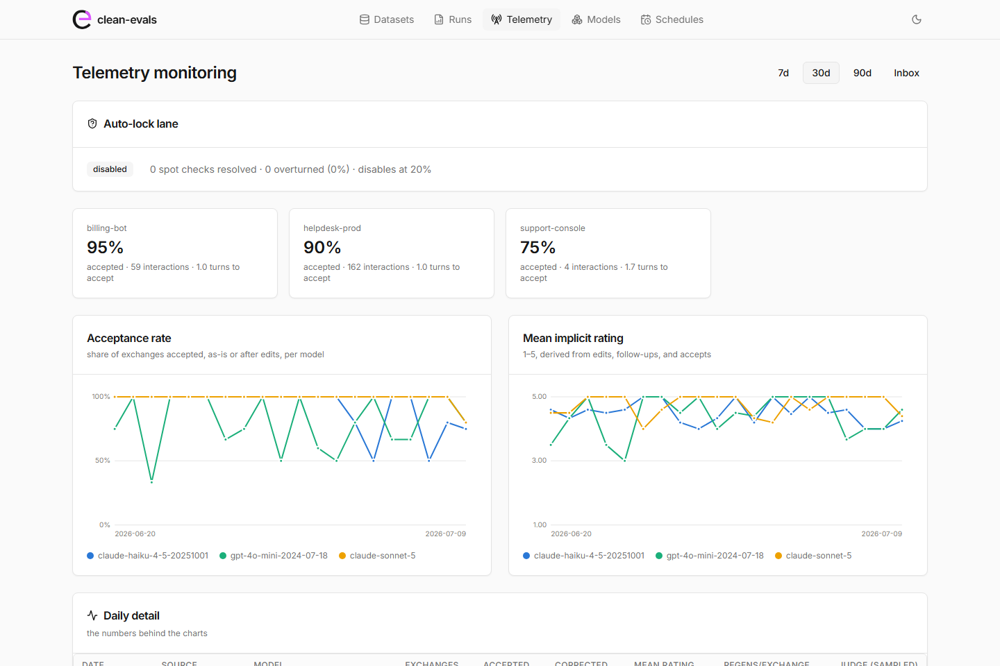

# Telemetry: production data into the golden path

Your application already runs requests against a model, and your users
already review the results — they edit fields, ask for something shorter,
hit regenerate, or accept. Telemetry ingestion turns those interactions
into dataset material: each one arrives as an envelope, derives into
reviewable *exchanges* with an implicit rating, and is promoted into a
dataset through the same review-and-lock flow the
[Dataset Builder](dataset-builder.md) uses.

Telemetry serves two purposes at once:

- **Mining** — real interactions become pre-rated candidate cases, so the
  golden dataset grows from production instead of hand-written inputs.
- **Monitoring** — the derived signals (acceptance rate, edit rate,
  corrections per turn, turns to accept) are tracked per source and model
  over time on the Telemetry monitoring page.



## How an interaction becomes a case



Every envelope is stored verbatim, so derivation is repeatable: after a
classifier or heuristic change, re-deriving never needs the producing
application again. Derivation is also idempotent per interaction — a
re-derivation (or a race between the post-ingest background pass and a
manual derive) replaces the interaction's unpromoted exchanges rather
than duplicating them; promoted exchanges are never touched.

## The envelope

One JSON object per interaction. Two kinds exist. Model ids are recorded
verbatim — the dated-snapshot rule applies to eval runs, not to logging
what production actually used.

### `structured` — single request, accept-or-edit

The user received a structured output and either committed it or edited
fields first. Derivation is deterministic and free.

```json
{
  "interaction_id": "tt-2026-0613",
  "occurred_at": "2026-07-08T10:02:13Z",
  "source": "helpdesk-prod",
  "dataset": "ticket-triage",
  "model": "gpt-4o-mini-2024-07-18",
  "kind": "structured",
  "request": {
    "system": "Triage the support ticket into queue and priority. Return JSON.",
    "input": {"text": "Payroll portal shows a 500 error when submitting timesheets."}
  },
  "response": {
    "content": "{\"queue\": \"software\", \"priority\": \"medium\"}",
    "parsed": {"queue": "software", "priority": "medium"}
  },
  "events": [
    {"type": "field_edit", "field": "priority", "old": "medium", "new": "urgent"},
    {"type": "accept", "final_output": {"queue": "payroll", "priority": "urgent"}}
  ]
}
```

Rating rules: an untouched accept is 5; edits scale the rating down by the
fraction of fields changed, capped at 4 (an edited output is by definition
not a perfect one). The field diffs become the rating's written feedback,
and the committed output becomes the proposed golden answer. **Without an
`accept` event the exchange derives as unrated** — the absence of a commit
action is never treated as approval.

### `transcript` — a whole conversation, verbatim

```json
{
  "interaction_id": "sr-2026-1182",
  "occurred_at": "2026-07-09T08:31:44Z",
  "source": "support-console",
  "dataset": "support-replies",
  "model": "claude-sonnet-5",
  "kind": "transcript",
  "system": "Draft replies to customer support emails.",
  "turns": [
    {"role": "user", "text": "Customer wants a refund outside the window. Draft a reply."},
    {"role": "assistant", "text": "Hi Sam, ..."},
    {"role": "user", "text": "too long, cut the second paragraph down"},
    {"role": "assistant", "text": "Hi Sam, ..."}
  ],
  "outcome": {"type": "accept"}
}
```

A transcript is *exploded*: each (user turn, assistant turn) pair becomes
one exchange, carrying all prior turns as its context. The signal comes
from what happened next — **the next user message is the user's review of
the previous response**. One classifier call per transcript labels every
follow-up as one of:

| Label | Meaning | Verdict |
|---|---|---|
| `correction` | "no, shorter" — wrong or unusable | negative |
| `accept_with_correction` | "thanks, but fix the date" | positive |
| `new_request` | "great, now translate it" — implicit accept | positive |
| `clarification_reply` | the assistant asked; the user answered | incomplete |
| `acceptance` | explicit praise or acceptance | positive |

The final exchange has no follow-up; its signal is the transcript's
terminal `outcome`. `accept` requires a real commit action in your
application (Save / Send / Apply). A transcript that just ends
(`"ended"`, or no outcome) leaves its final exchange **unrated**, because
satisfaction and abandonment look identical from the outside. Each
regeneration recorded on an assistant turn lowers the exchange's rating by
one point — retrying is a strong negative signal.

Discarded regeneration alternatives are kept: on promotion they become
additional candidate outputs for the same case, so a regenerated exchange
is literally a pre-played blind review.

A classifier failure derives the transcript with no labels — exchanges
come out unrated rather than invented.

## Ingesting

### Web service (token-gated)

The batch endpoint is the only authenticated surface in clean-evals, and
it is **dark by default**: until `CLEAN_EVALS_INGEST_TOKEN` is set, the
route answers 404, so a default install grows no new attack surface.

```bash
curl -X POST http://localhost:8080/api/v1/telemetry/interactions \
  -H "Authorization: Bearer $CLEAN_EVALS_INGEST_TOKEN" \
  -H "Content-Type: application/json" \
  -d '[{"interaction_id": "...", ...}]'
```

The response reports per-item outcomes — invalid envelopes are rejected
individually with their index and reason, and duplicate
`(source, interaction_id)` pairs are skipped, so retrying a batch is
idempotent. Derivation runs in the background after each accepted batch.

The token protects this route only. Everything else remains
unauthenticated: the ingest endpoint being reachable by your application
does **not** make the rest of the instance safe to expose. Put the
instance behind a reverse proxy that terminates TLS and forwards *only*
`/api/v1/telemetry/interactions` to it — see
[Running clean-evals](deployment.md).

### Manual upload

The Telemetry page accepts the same envelopes as a JSONL file (one per
line) — no token involved, since the upload happens in the local UI.
`examples/telemetry/` in the repository contains working samples of both
kinds.

### PII

Telemetry is production data by definition. Envelopes are stored **raw**
unless a telemetry scrubber is configured; every ingest response and the
inbox state this plainly. To scrub before anything is persisted, implement
`TelemetryScrubber`, register it under the
`clean_evals.telemetry_scrubbers` entry-point group, and name it in
`CLEAN_EVALS_TELEMETRY_SCRUBBER`. A configured-but-broken scrubber fails
ingest loudly rather than silently storing raw data. See
[Production data and PII](pii.md).

## Review and promotion

Derived exchanges land in the Telemetry inbox showing the request, the
response, the conversation context, the implicit verdict and rating, the
generated feedback, and the proposed golden answer. Reviewing one either
**promotes** it — creating a case, candidate output(s), and an implicit
rating (`source="implicit"`) in the target dataset — or **discards** it.

The `dataset` field of the envelope names the target dataset; the latest
version is used, and a missing dataset is created (`v1`, `llm_judge`
scorer). Transcripts create a `chat`-shaped dataset and carry their
production system prompt per case; structured interactions create a
`templated` one whose system prompt is taken from the first promoted
interaction — the templated shape renders a single-field input verbatim
and sends the system prompt in the system role, exactly as production
did. Promotion refuses duplicates (an identical (context, request)
already promoted to the same dataset) and refuses to put a transcript
exchange into a dataset that is not chat-shaped — its context could not
replay there.

Only positive exchanges propose their own response as the golden answer.
A corrected response's eventual replacement satisfies *refined*
constraints the original request never stated — so negative exchanges
promote without a proposal, and you pick or write the expected answer in
the Builder.

### Why a human confirms

The golden dataset is a measurement instrument. Whoever assigns its labels
needs two properties: **independence** from the models being measured, and
a **measurable error rate**. Human review has both — reviewer noise is
random with respect to the models, and judge calibration quantifies it as
Cohen's kappa. An LLM judge selecting its own calibration data has
neither: its errors correlate with the models under test, and the kappa
becomes circular. The implicit signal alone is independent but
systematically optimistic — accepting is one click, editing is work. So
implicit ratings pre-fill, and a human confirms.

### The auto-lock lane (opt-in)

When several *independent* signals concur, their errors multiply out.
With `CLEAN_EVALS_TELEMETRY_AUTOLOCK=1`, an exchange is promoted and
locked without review when **all** of the following hold:

1. An explicit accept — labels `accepted` / `accepted_with_edits` only; a
   real commit action, never inferred approval.
2. Implicit rating ≥ 4 and a proposed golden answer.
3. The dataset has a calibrated judge with kappa ≥
   `CLEAN_EVALS_TELEMETRY_AUTOLOCK_KAPPA` (default 0.6) that passes the
   response.

The lane measures itself: a fraction of auto-locked exchanges
(`CLEAN_EVALS_TELEMETRY_SPOTCHECK_RATE`, default 10%) routes to human
spot-check anyway. Overturning a spot check unlocks the case, and when the
overturn rate crosses `CLEAN_EVALS_TELEMETRY_OVERTURN_DISABLE` (default
20%, over at least 5 resolved checks) the lane disables itself. No
automated pathway runs without a measured error estimate.

## Replaying transcript cases: the chat shape

A promoted transcript exchange stores its conversation prefix in the case
input, and the dataset gets `request_shape: "chat"`: eval runs replay the
prior turns as message history and send the case's `message` as the final
user message. Flattening the context into one text blob would replay a
*different* request than production sent, so it isn't done. One
normalisation does happen at assembly: consecutive same-role turns merge
into a single message (joined by a blank line), and a trailing user turn
folds into the final message — several providers reject non-alternating
roles outright, and the merged form is what they would have accepted from
the producing application in the first place. A context that *starts*
with an assistant turn is sent as-is; providers that reject it fail that
case with a visible error rather than clean-evals fabricating an opening
user message.

```json
{
  "system": "Draft replies to customer support emails.",
  "context": [
    {"role": "user", "text": "Customer reports the app crashes on launch. Draft a reply."},
    {"role": "assistant", "text": "Hi there, could you tell me which device..."},
    {"role": "user", "text": "they already said iPhone 15, iOS 19. read the ticket"}
  ],
  "message": "they already said iPhone 15, iOS 19. read the ticket"
}
```

All built-in adapters support history replay. Custom adapters accept an
optional `history` parameter — see
[Writing an adapter](writing-an-adapter.md); the runner only passes it
when a case actually has history, so adapters written before this
parameter keep working for single-shot datasets.

## Monitoring



The monitoring page charts, per source and model over time: acceptance
rate, mean implicit rating, correction rate, regenerations per exchange,
and turns-to-accept — plus the auto-lock lane's health (spot checks
resolved, overturn rate, self-disable status). The full daily table sits
under the charts.

Judge-scored sampling — scoring a fraction of incoming exchanges with the
dataset's calibrated judge — is **off by default** because it spends
money. Enable it with `CLEAN_EVALS_TELEMETRY_JUDGE_SAMPLE_RATE` (0–1).
Judge sampling spend is not metered by the telemetry ceiling; the sample
rate bounds the call count, and actual spend shows up only in your
provider's billing console.

## Configuration

| Variable | Default | Purpose |
|---|---|---|
| `CLEAN_EVALS_INGEST_TOKEN` | unset (endpoint dark) | Bearer token for the ingest route |
| `CLEAN_EVALS_TELEMETRY_CLASSIFIER_MODEL` | `claude-haiku-4-5-20251001` | Transcript follow-up classifier |
| `CLEAN_EVALS_TELEMETRY_DAILY_COST_LIMIT_USD` | `5.0` | Classifier spend ceiling per UTC day (best-effort) |
| `CLEAN_EVALS_TELEMETRY_SCRUBBER` | unset (stored raw) | Entry-point name of a `TelemetryScrubber` |
| `CLEAN_EVALS_TELEMETRY_AUTOLOCK` | off | Enables the auto-lock lane |
| `CLEAN_EVALS_TELEMETRY_AUTOLOCK_KAPPA` | `0.6` | Minimum judge-calibration kappa for the lane |
| `CLEAN_EVALS_TELEMETRY_SPOTCHECK_RATE` | `0.10` | Fraction of auto-locks routed to spot-check |
| `CLEAN_EVALS_TELEMETRY_OVERTURN_DISABLE` | `0.2` | Overturn rate at which the lane self-disables |
| `CLEAN_EVALS_TELEMETRY_JUDGE_SAMPLE_RATE` | `0.0` (off) | Fraction of exchanges judge-scored for monitoring |

Transcript classification costs one small-model call per transcript; the
ceiling is checked before each call and interactions over budget stay
pending and are retried by the next derivation pass. Like every cost
limit in clean-evals, it is best-effort — verify actual spend in your
provider's billing console.

Retention is deliberately absent: telemetry tables grow until you delete
from them. Sampling, caps, and cleanup are the operator's concern; the
mechanism stays correct at any volume you choose to keep.
