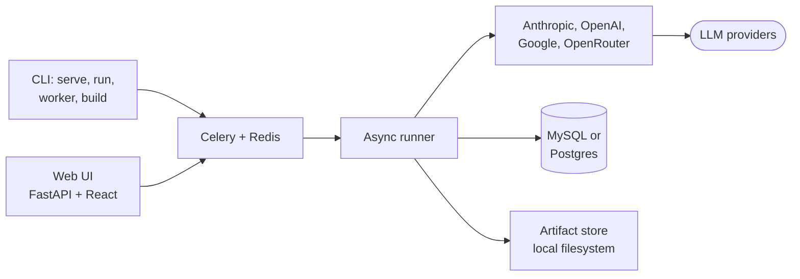

# clean-evals

> Measure AI quality across models. Build a golden dataset by working with real
> data. Pick the right model with the math in plain view.

clean-evals is a standalone open-source application for measuring AI
quality across models. It runs as its own process — CLI plus local web
UI — and owns its own data. You bring the prompts and inputs your
application sends to a model; clean-evals measures which model answers
them best and what that costs.

## Capabilities, in order of importance

1. **[Dataset Builder](guides/dataset-builder.md)** — bring inputs, run them
   through your candidate models, pick or edit the best output, lock it in
   as the expected answer. The golden dataset emerges from working with
   real data, not from authoring JSON by hand.

2. **Eval Runner** — async, queue-backed (Celery + Redis), deterministic,
   plugin-extensible. Strict typing, clean public API, machine- and
   human-readable output.

3. **Decision UI** — the headline view shows three model recommendations
   side-by-side (max accuracy, best price/performance, lowest cost) with
   the [comparison math](concepts/recommendations.md) visible, plus per-case
   heatmaps and cost projections.

## Get started in 5 minutes

```bash
pip install clean-evals
clean-evals migrate
export ANTHROPIC_API_KEY=...
export OPENAI_API_KEY=...
clean-evals run examples/sentiment/dataset.yml \
  --models claude-3-5-sonnet-20241022,gpt-4o-mini-2024-07-18 \
  --max-cost 0.50
clean-evals serve   # http://localhost:8080
```

Full walk-through: [Getting started](getting-started.md).

## Design principles

clean-evals is built to be a tool a senior engineer reads and trusts in
fifteen minutes:

- **Boring, typed Python.** `mypy --strict`, no `Any`, no metaclass tricks.
- **Pure-async core.** Adapters and the runner are `async`-native.
- **Zero-magic config.** Pydantic with `extra="forbid"`. Datasets are static
  documents — no env-var interpolation, no Jinja, no string templating.
- **Failure is data.** A model erroring on a case produces a `CaseResult`
  with `status="error"` — runs never crash on a single bad call.
- **Determinism by default.** With `temperature=0` + a seeded provider, the
  same dataset + same models produce byte-identical scored output.
- **Everything is inspectable.** Readable source, plugin extension points,
  and dated model snapshots, so every result traces back to the exact
  model that produced it.

## Architecture at a glance



## License

Copyright (c) 2026 datathere.

clean-evals is open source under the [GNU
AGPL-3.0](https://github.com/datathere/clean-evals/blob/main/LICENSE). You
may use, modify, and redistribute it under the license terms, including
commercially. The AGPL's copyleft applies: if you modify clean-evals and
make it available to others, including over a network, you must make your
modified source code available under the same license.

**Commercial licenses** are available for organizations that cannot accept
the AGPL's obligations. Contact `licenses@datathere.com`.

The "clean-evals" and "by datathere" marks are governed by the
[Brand Use Policy](branding.md); the in-product attribution is a protected
legal notice under section 7(b) of the license and must remain intact.
