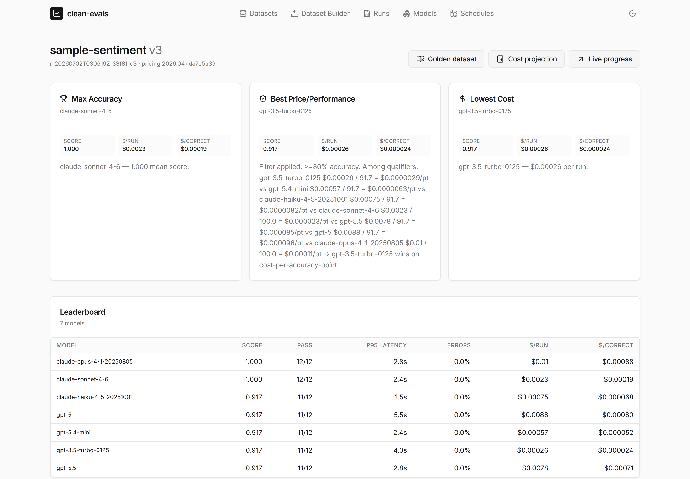
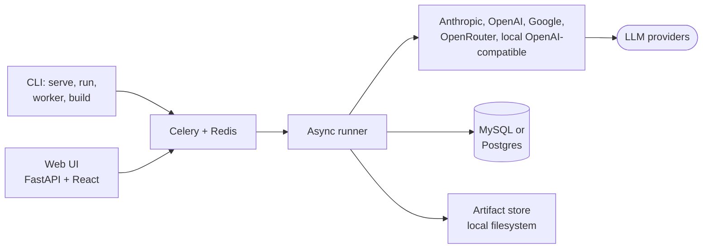

# clean-evals

> Try out your prompts and context across AI models. Run evals and find
> the best model for your use case.

clean-evals is an open-source application for evaluating AI model
quality, reliability, and cost. It compares model outputs using the
prompts and inputs from an existing application, supports blind review
and golden dataset creation, and runs repeatable evaluations across
models.

clean-evals runs locally through a CLI and web interface, with
evaluation data stored in your own environment.

## Capabilities

1. **[Dataset Builder](guides/dataset-builder.md)** — upload inputs,
   generate outputs from candidate models, pick or edit the best output,
   and lock it as the expected answer. Locked cases form the golden
   dataset.

2. **Eval Runner** — async, queue-backed (Celery + Redis), deterministic,
   plugin-extensible. Strict typing, clean public API, machine- and
   human-readable output.

3. **Decision UI** — shows three model recommendations per run
   (max accuracy, best price/performance, lowest cost) with
   the [comparison math](concepts/recommendations.md), plus per-case
   heatmaps and cost projections.

4. **[Telemetry](guides/telemetry.md)** — ingest production interactions
   (the request, the response, and what the user did next); each derives
   into a pre-rated candidate case for the golden dataset, and the same
   signals feed per-model quality monitoring over time.



## Quick start

```bash
pip install clean-evals
clean-evals migrate
export ANTHROPIC_API_KEY=...
export OPENAI_API_KEY=...
clean-evals run examples/sentiment/dataset.yml \
  --models claude-3-5-sonnet-20241022,gpt-4o-mini-2024-07-18 \
  --max-cost 0.50
clean-evals serve   # http://localhost:8080
```

Full walk-through: [Getting started](getting-started.md).

## Design principles

- **Strictly typed Python.** `mypy --strict`, no `Any`, no metaclasses.
- **Pure-async core.** Adapters and the runner are `async`-native.
- **Explicit config.** Pydantic with `extra="forbid"`. Datasets are static
  documents with no env-var interpolation and no template engine.
- **Failure is data.** A model erroring on a case produces a `CaseResult`
  with `status="error"`; the run continues.
- **Determinism by default.** With `temperature=0` + a seeded provider, the
  same dataset + same models produce byte-identical scored output.
- **Inspectable results.** Readable source, plugin extension points, and
  dated model snapshots, so results trace back to the exact model that
  produced them.

## Architecture



## License

Copyright (c) 2026 datathere.

clean-evals is open source under the [GNU
AGPL-3.0](https://github.com/datathere/clean-evals/blob/main/LICENSE). You
may use, modify, and redistribute it under the license terms, including
commercially. The AGPL's copyleft applies: if you modify clean-evals and
make it available to others, including over a network, you must make your
modified source code available under the same license.

**Commercial licenses** are available for organizations that cannot accept
the AGPL's obligations. Contact `licenses@datathere.com`.

The "clean-evals" and "by datathere" marks are governed by the
[Brand Use Policy](branding.md); the in-product attribution is a protected
legal notice under section 7(b) of the license and must remain intact.
